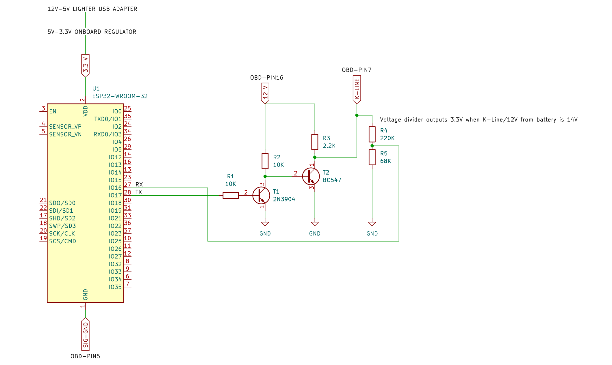

# OBD9141_C_Core

**OBD9141_C_Core** is a C translation and adaptation of the original [OBD9141 Arduino library](https://github.com/iwanders/OBD9141) by Ivor Wanders.  

This version is designed for **ESP-IDF** but includes **framework-agnostic template functions** to allow easy porting to other frameworks or C environments.

## Features

- Full translation from Arduino C++ to C (ESP-IDF).
- Template functions for framework portability.
- Examples for requesting current PIDs, reading DTCs and listing supported PIDs.
- Retains original logic and structure of the OBD9141 library.

## Protocol Support

Currently, **only KWP2000 Fast Init (ISO 14230-4)** has been tested (on a 2005 Opel Corsa). 
Other initialisation handshakes (e.g. K-Line 5-baud init) are included in the code but **need community testing and confirmation**.  

If you have access to different ECUs and can help test additional handshake modes, contributions are welcome.

## Wiring Diagram

Below is a wiring diagram of the components used to establish communication with the car:

  

The wiring was inspired by the tutorial [Cheap OBD2 Communications on K-line (ISO 9141-2 and ISO 14230-4)](https://www.instructables.com/Low-Cost-OBD2-Communications-on-K-line-ISO-9141-2-/) and refined with guidance from my professor, **Prof. Stoyan Stoyanov, Assistant Professor (PhD)**, who assisted in designing the wiring setup shown.

## License

This project, including all original and modified code, is released under the **MIT License**.  
See [LICENSE](LICENSE.md) for full details.

## Credits

- **Original library**: OBD9141 by Ivor Wanders (https://github.com/iwanders/OBD9141), MIT License.  
- **Wiring inspiration**: [Cheap OBD2 Communications on K-line (ISO 9141-2 and ISO 14230-4)](https://www.instructables.com/Low-Cost-OBD2-Communications-on-K-line-ISO-9141-2-/)  
- **Academic guidance**: Prof. Stoyan Stoyanov, Assistant Professor (PhD) — support in designing wiring.  
- **This adaptation**: Georgi Georgiev, 2025, MIT License.
